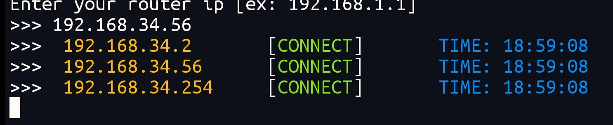

<p align="center">
  
  
  
</p>

# network_scanning

Close monitoring of the wifi network

# Description

Monitor IP network in direct time
Know the IP connected to the Internet and the IP of the device that disconnected from the Internet
with time details

# screenshot



# requests

* python3 and up
* internet
* module requests

# install

```
git clone https://moayad-star/network_scanning.git
```

```
cd network_scanning
```

`
for start scan
`

```
python3 network_scanning.py
```

`
for update
`

```
python3 update.py
```
`for stop` `ctrl + c`
