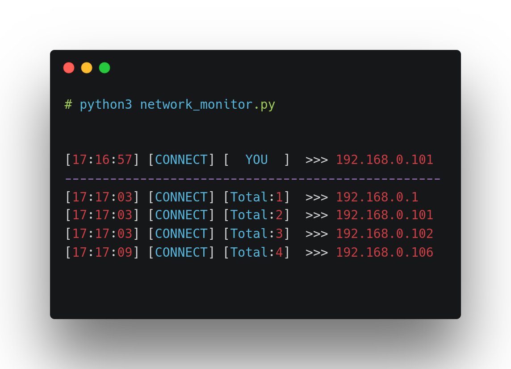

<p align="center">
  
  
  
  
</p>

# network_monitor

Close monitoring of the wifi network

## Description

Live IP Network Surveillance: Maintain a vigilant watch over your network in real time, providing detailed records of internet connectivity and pinpointing the exact moment devices disconnect.

## preview



## requests

* python3.x and up
* module nmap
* linux

## Features

* who connected to the network
* who disconnected to the network
* How many people are connected to the network
* Categorize them on time status
* Professional look
* Useful for network engineers
* open source
* General adjustable
* Fast and safe (It does not collect any information)

## install

> install network monitor

```
git clone https://github.com/moayad-star/network_monitor
```

> open the network scan file

```
cd network_monitor
```

> for start scan

```
python3 network_monitor.py
```

> for update

```
python3 update.py
```
> for stop `ctrl + c`

### Issues ?

Feel free to ask your issues [here!](https://github.com/moayad-star/network_monitor/issues)
